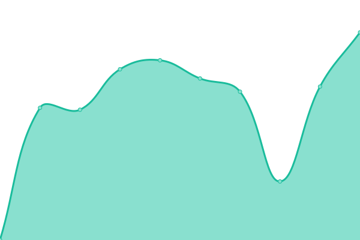
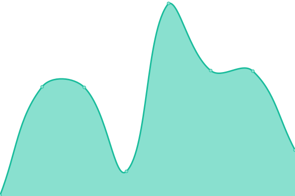

# [📈 Live Status](https://Daught.github.io/upptime): <!--live status--> **🟧 Partial outage**

This repository contains the open-source uptime monitor and status page for [Sebastian Fernandez](https://Daught.github.io/upptime), powered by [Upptime](https://github.com/upptime/upptime).

With [Upptime](https://upptime.js.org), you can get your own unlimited and free uptime monitor and status page, powered entirely by a GitHub repository. We use [Issues](https://github.com/Daught/upptime/issues) as incident reports, [Actions](https://github.com/Daught/upptime/actions) as uptime monitors, and [Pages](https://Daught.github.io/upptime) for the status page.

<!--start: status pages-->
<!-- This summary is generated by Upptime (https://github.com/upptime/upptime) -->
<!-- Do not edit this manually, your changes will be overwritten -->
<!-- prettier-ignore -->
| URL | Status | History | Response Time | Uptime |
| --- | ------ | ------- | ------------- | ------ |
|  [Handballkids](https://www.handballkids.ch/jugendfoerderung-handball-aargau) | 🟩 Up | [handballkids.yml](https://github.com/Daught/upptime/commits/HEAD/history/handballkids.yml) | 

 825ms
     
 | 

<a href="https://Daught.github.io/upptime/history/handballkids">86.24%</a>
    

|  [Dackel_Jordan](http://dackeljordan.ch) | 🟩 Up | [dackel-jordan.yml](https://github.com/Daught/upptime/commits/HEAD/history/dackel-jordan.yml) | 

 1385ms
     
 | 

<a href="https://Daught.github.io/upptime/history/dackel-jordan">99.18%</a>
    

|  [Wikipedia](https://en.wikipedia.org) | 🟩 Up | [wikipedia.yml](https://github.com/Daught/upptime/commits/HEAD/history/wikipedia.yml) | 

 565ms
     
 | 

<a href="https://Daught.github.io/upptime/history/wikipedia">100.00%</a>
    

|  [3to5](https://www.3to5.ch/) | 🟥 Down | [3to5.yml](https://github.com/Daught/upptime/commits/HEAD/history/3to5.yml) | 

 0ms
     
 | 

<a href="https://Daught.github.io/upptime/history/3to5">0.00%</a>
    

|  [Daught](http://www.sebastianfernandez.ch/) | 🟥 Down | [daught.yml](https://github.com/Daught/upptime/commits/HEAD/history/daught.yml) | 

 0ms
     
 | 

<a href="https://Daught.github.io/upptime/history/daught">0.00%</a>
    

<!--end: status pages-->

[**Visit our status website →**](https://Daught.github.io/upptime)

## 📄 License

- Powered by: [Upptime](https://github.com/upptime/upptime)
- Code: [MIT](./LICENSE) © [Sebastian Fernandez](https://Daught.github.io/upptime)
- Data in the `./history` directory: [Open Database License](https://opendatacommons.org/licenses/odbl/1-0/)
